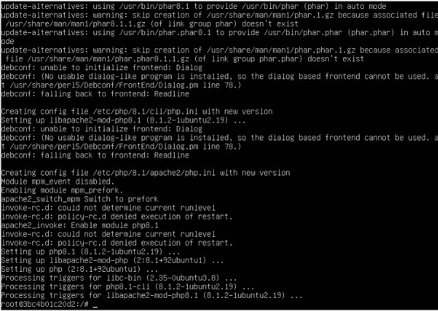
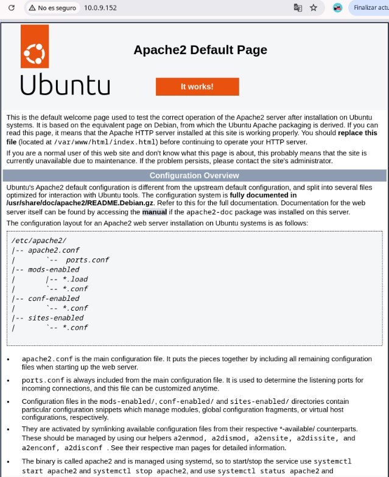
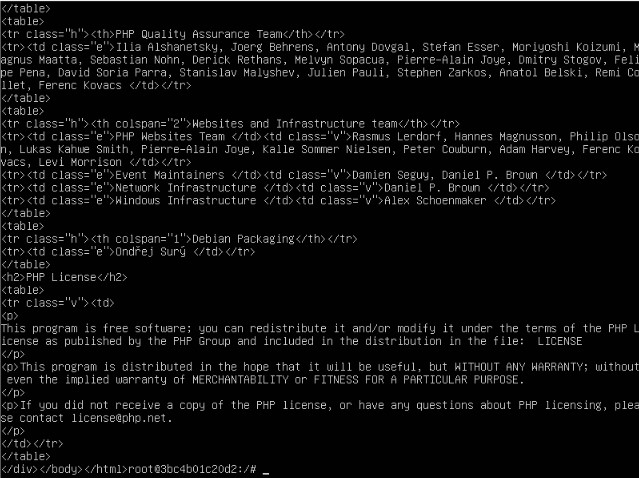

# Tarea4SXE

>1. Utiliza la imagen de Ubuntu , tag 22 y apoyandote en esta guía sigue sus instrucciones para instalar LAMP en dicho contenedor.

Lo primero que debemos hacer es descargar la imágen de ubuntu con el tag indicado
-`sudo docker pull ubuntu:22.04` y con -`sudo docker images` comprobamos que existe

Ahora instalaremos LAMP, primero creamos y arrancamos el  contenedor:
-`sudo docker container create -i -t  -p  8080:80 --name pruebaWordpres ubuntu:22.04`
-`sudo docker container start --attach -i  pruebaWordpres`

Siguiendo los pasos de la guía,actualizamos los paquetes:
-`sudo apt update`

Instalamos apache2 y luego el servidor de base de datos mariaDB:
-`sudo apt install -y apache2 apache2-utils`
-`sudo apt install -y mariadb-server mariadb-client`

Utilizamos el siguiente comando para proteger la instalación mySQL
-`sudo mysql_secure_installation`

Instalamos php
-`sudo apt install -y php php-mysql libapache2-mod-php`

Tras eso nos preguntara nuestra región y zona horaria, despues comenzará a mostrarse una pantalla con el proceso de instalación

Ahora probámos apache con el siguiente comando:
-`echo "<?php phpinfo(); ?>" | sudo tee /var/www/html/info.php`

En el navegador introducimos http://10.0.9.152 (la ip de mi máquina) y entraríamos a la página por defecto de apache

Ahóra procedémos con la instalación de curl:
-`apt-get update && apt-get install -y curl`

y comprobamos el funcionamiento del archivo info.php
-`curl localhost/info.php`

